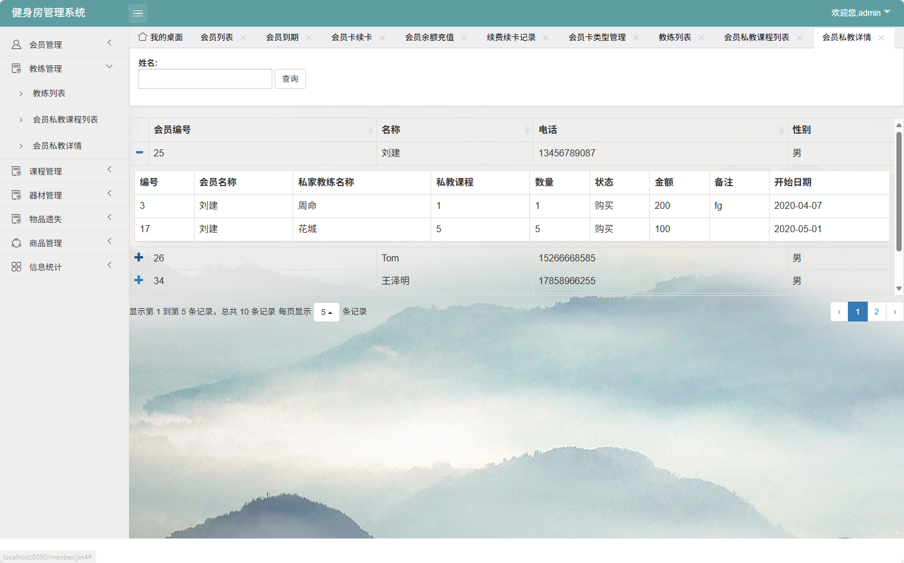

# 健身房管理系统(文末免费领取☟)
> 
#### 介绍
健身房管理系统(Java_SpringBoot)
有BUG可留言加微

#### 软件架构
1. web框架：SpringBoot
2. 数据库框架：Sping Data JPA
3. 数据库：MySql
4. 项目构建工具：Maven
5. 前端模板：JSP
6. 安全框架：Shiro
7. 前端框架：BootStrap,Layui
8. 数据图表：ECharts

#### 项目功能说明

> + 会员管理：会员管理、会员到期
> + 会员充值管理：会员卡续卡、会员余额充值、续费续卡记录、会员卡类型管理
> + 教练管理：教练列表、会员私教课程列表、会员私教详情
> + 课程管理：课程列表
> + 器材管理：器材信息
> + 物品遗失：物品归还
> + 商品管理：商品列表、商品售卖信息
> + 信息统计：收入统计

### 部分功能演示

### 环境需求(可免费提供)
- idea/eclipse、jdk-1.8、maven-3.8.6、mysql、node.js等

## 有项目修改、安装调试需求 请联系以下

## 获取资源扫☝☝☝

